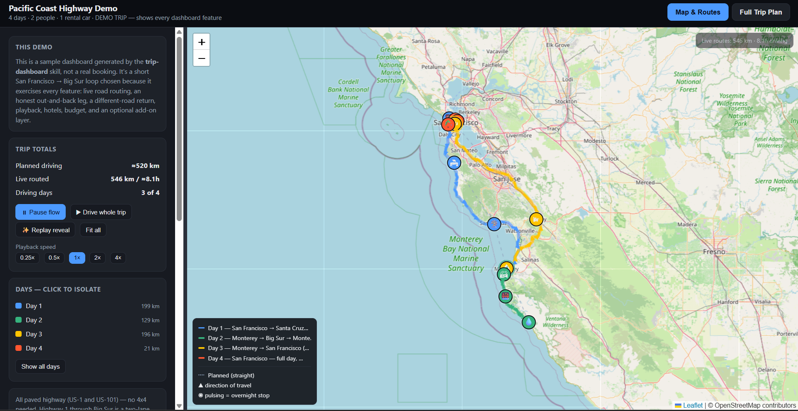
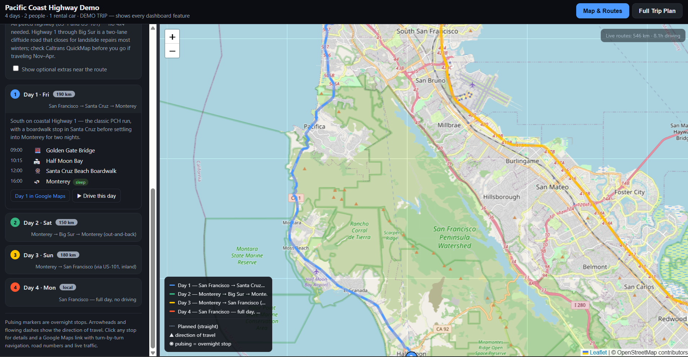
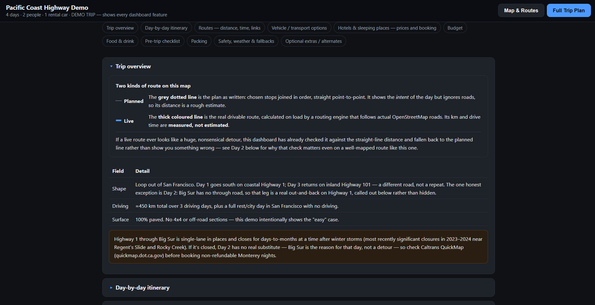
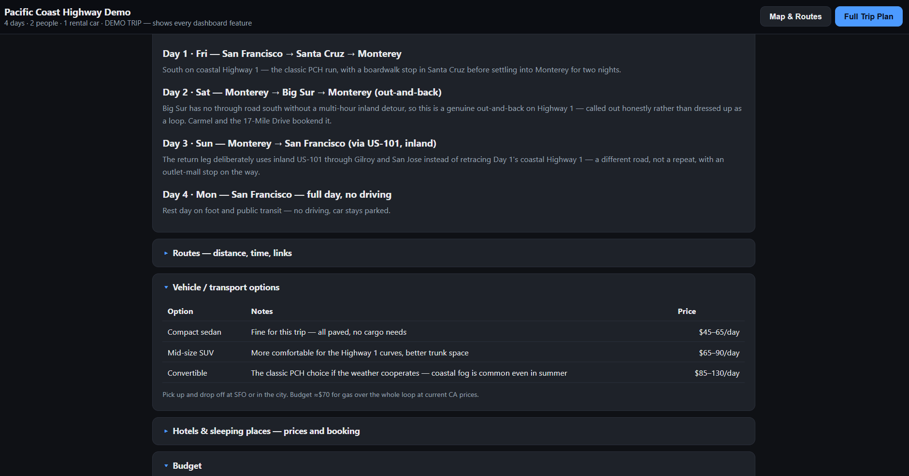

# Trip Planner Dashboard

<p align="center">
  
</p>

<p align="center">
  <strong>An AI skill for Claude, Cursor, and other skill-compatible tools</strong><br />
  Plan a trip in plain words. Get one HTML file with a live map and a full written plan.
</p>

---

Ask for a trip. Get back a single dashboard file you can open in any browser. Map on one tab. Itinerary, hotels, budget, packing, and safety on the other. No server. No API key. No build step.

### **Personal note. Why I created this skill**

I built this after planning a real 6-day jeep trip in Georgia (the country). The first versions had wrong turns, a fake 300 km detour from bad map data, layout bugs, and no easy way to “drive” the route on the map. After fixing those pieces over many rounds, I packed the working parts into this skill so the next “plan my trip” request starts from something that already works, not from a blank file.

---

## **Contents**

1. [Quick start](#quick-start)
2. [Screenshots](#screenshots)
3. [Features](#features)
4. [How to use with Claude](#how-to-use-with-claude) (click to expand)
5. [How to use with Cursor](#how-to-use-with-cursor) (click to expand)
6. [Example prompts](#example-prompts)
7. [What is in this folder](#what-is-in-this-folder)
8. [License](#license)

---

## **Quick start**

| Step | What to do |
| --- | --- |
| 1 | Open the [demo](examples/demo-trip.html) in your browser to see what you get |
| 2 | Pick your tool below (**Claude** or **Cursor**) and follow the steps |
| 3 | Ask for a trip in normal words |
| 4 | Open the HTML file the AI creates |

Works with **Claude**, **Cursor**, and other tools that support skills. Put this folder in that tool’s skills place, then ask it to plan a trip.

---

## **Screenshots**

<details open>
<summary><strong>Map and Routes</strong> (click to collapse)</summary>

<br />



*Live routes and playback controls.*



*Day list with stops, Google Maps link, and Drive this day.*

</details>

<details open>
<summary><strong>Full Trip Plan</strong> (click to collapse)</summary>

<br />



*Trip overview and road notes.*



*Day-by-day itinerary and vehicle options.*

</details>

---

## **Features**

| Feature | What you get |
| --- | --- |
| **Live-routed map** | Dotted planned line + thick live line on real roads, with distance and drive time |
| **Detour-safe routing** | Falls back to the planned line if a live route looks impossible |
| **Drive-the-trip playback** | Animated marker, speed control, pause or resume |
| **Day-by-day itinerary** | Colour by day, stops, tips, Google Maps link per day |
| **Transport costs** | Cars, trains, or flights with rough price ranges |
| **Hotels and lodging** | Price bands and booking links for your group |
| **Practical lists** | Budget, food, packing, and a pre-trip checklist |
| **Safety and fallbacks** | What to do if a road closes or weather turns |
| **Any screen size** | Day filters, draggable split view, tooltips |

**Try the demo first.** Open [`examples/demo-trip.html`](examples/demo-trip.html). No install needed. Short 4-day San Francisco to Big Sur loop. Day 2 is Monterey to Big Sur and back on purpose, because there is no through road south.

---

## **How to use with Claude**

<details>
<summary><strong>Click to expand. Claude website, Claude Code, and API</strong></summary>

<br />

### On the Claude website (claude.ai)

<details>
<summary><strong>1. How to get the zip file</strong></summary>

<br />

1. Open this project’s page on GitHub.
2. Click the green **Code** button near the top right.
3. Click **Download ZIP**.
4. Wait for the download to finish. You will get a file like `trip-dashboard-skill-main.zip` in your Downloads folder.
5. Keep that zip as is. You do not need to unzip it for the website upload.

</details>

<details>
<summary><strong>2. How to add the skill on claude.ai</strong></summary>

<br />

1. Open [claude.ai](https://claude.ai) and sign in.
2. Go to **Settings**, then **Features**, then **Skills**.
3. Upload the zip you downloaded. You need a plan that allows Skills (Pro, Max, Team, or Enterprise, with code execution on).
4. Start a new chat.
5. Type what you want, for example  
   `Plan a 7-day road trip through Scotland for 4 of us, renting one car.`
6. Answer any follow-up questions (dates, budget, and so on).
7. When Claude finishes, open or download the HTML file it made. Double-click it to open in your browser.

</details>

### In Claude Code (on your computer)

<details>
<summary><strong>Click to expand. Install steps for Claude Code</strong></summary>

<br />

1. Get the project folder. Download the zip (steps above) and unzip it, or copy the folder if you already have it.
2. Put that folder here so Claude can find it  
   - For every project on your computer  
     `~/.claude/skills/trip-dashboard/`  
   - Or only for one project  
     `your-project-folder/.claude/skills/trip-dashboard/`
3. Close Claude Code and open it again (or start a new chat).
4. Type a trip request in normal words.
5. Open the HTML file Claude saves in your browser.

</details>

### With the Claude API or Cowork

<details>
<summary><strong>Click to expand. API / Cowork</strong></summary>

<br />

1. Upload this skill with the Skills API.
2. Ask for a trip plan in normal words, same as above.

</details>

</details>

---

## **How to use with Cursor**

<details>
<summary><strong>Click to expand. Step-by-step for Cursor Agent</strong></summary>

<br />

1. Get the project folder.  
   - Open this project on GitHub.  
   - Click the green **Code** button.  
   - Click **Download ZIP**.  
   - Unzip the file (or copy the folder if you already have it).
2. Put that folder here so Cursor can find it  
   - For every project on your computer  
     `~/.cursor/skills/trip-dashboard/`  
   - Or only for one project  
     `your-project-folder/.cursor/skills/trip-dashboard/`  
   Tip. If you already put it under `.claude/skills/` for Claude, Cursor can often use that copy too. You do not need two copies.
3. Restart Cursor, or open a new **Agent** chat.
4. In Agent, type what you want in normal words.  
   - `Plan a 7-day road trip through Scotland for 4 of us, renting one car.`  
   - `Build me a family trip dashboard. Oregon coast, 5 days, driving from Portland, kid-friendly.`  
   You can also type `/trip-dashboard` and then describe the trip.
5. Answer any questions the agent asks.
6. When it is done, open the HTML file it created in your browser.

</details>

---

## **Example prompts**

Use these in Claude or Cursor after the skill is installed.

- Plan a 7-day road trip through Scotland for 4 of us, renting one car.
- We are doing a 10-day Italy trip by train. Rome, Florence, Cinque Terre, Venice. Food and wine over museums.
- Build me a family trip dashboard. Oregon coast, 5 days, driving from Portland, kid-friendly.

The AI may ask for dates, group size, transport, or budget if you left those out. Then it builds one HTML file. You can open the file offline in a browser. The map still needs internet for tiles and live routing.

---

## **What is in this folder**

<details>
<summary><strong>Click to expand. Folder layout</strong></summary>

<br />

```
trip-dashboard-skill/
├── README.md                        (this file)
├── SKILL.md                         (instructions the AI reads)
├── assets/
│   ├── dashboard_template.html      (map and plan engine)
│   ├── tripIntro.jpeg               (README intro image)
│   ├── trip1.png                    (screenshot, Map and Routes)
│   ├── trip2.png                    (screenshot, Trip overview)
│   ├── trip3.png                    (screenshot, Day-by-day itinerary)
│   └── trip4.png                    (screenshot, Day sidebar on map)
├── examples/
│   └── demo-trip.html               (working demo you can open now)
├── scripts/
│   └── verify_js.py                 (checks the dashboard JavaScript)
└── evals/
    └── evals.json                   (test prompts from development)
```

</details>

---

## **License**

MIT. Use it, fork it, adapt it for your own trips.
